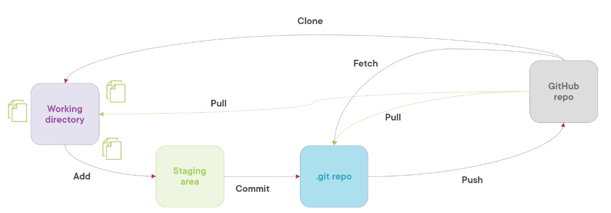
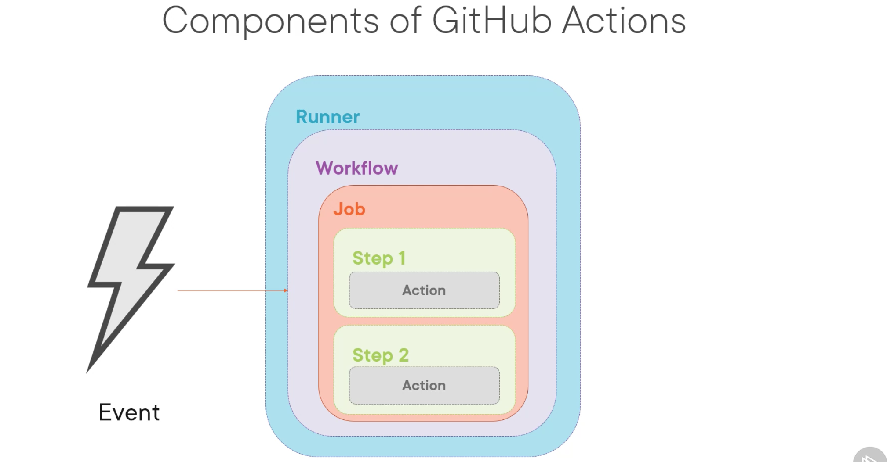

# Git Action
## Git basic
3 states of git: **modified**, **committed** and **staged**; all in local.

4 areas of git: **working directory**, **staging area**, **.git repo(local)** and **global remote repo GitHub**.

git config: git config --edit --global too check all global arguments.

git status: show branch and any changes.

git log: to show all commit history
## GitHub

git pull = git fetch + git merge

branching Strategies: centralized workflow, gitFlow workflow(main->stable, development->unstated), forking workflow(copy first), GitHub workflow(commit, PR, review, approval, merge).

pull_request_template.md: to create a pr template.

PR and issues are numbering together. 

blame function: to show all the latest history for lines.

## Github Action
Automating tasks in Github. Event-driven. Live in repo. Based on YAML syntax. Part of github, lots of templates, free plan.

SDLC: software development life cycle.

